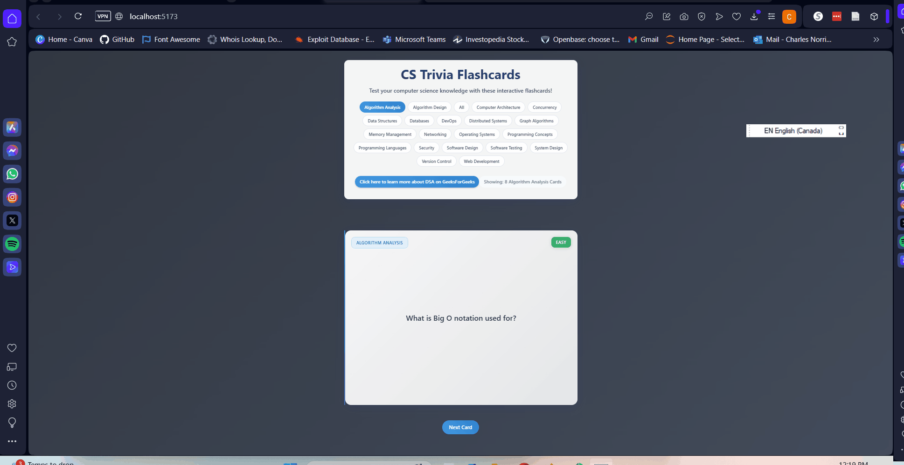

# Web Development Project 2 - CSTrivia

Submitted by: Charles Norris

This web app: An interactive flashcard application built with React and Vite that helps users learn computer science concepts. The app features:

- 150+ flashcards covering various CS topics including:
  - Algorithm Analysis
  - Data Structures
  - Operating Systems
  - Web Development
  - System Design
  - Databases
  - Security
  - And more!
- Difficulty levels (Easy, Medium, Hard)
- Subject filtering
- Interactive card flipping
- Responsive design with accessibility features
- Random card selection

# Web Development Project 3 - CS Trivia

Submitted by: Charles Norris

This web app:  An interactive flashcard application built with React and Vite that helps users learn computer science concepts.

Time spent: 6 hours spent in total

## Required Features

The following **required** functionality is completed:

- [X] **The user can enter their guess in a box before seeing the flipside of the card**
- [X] **Clicking on a submit button shows visual feedback about whether the answer was correct or incorrect**
- [X] **A back button is displayed on the card and can be used to return to the previous card in a set sequence**
- [X] **A next button is displayed on the card and can be used to navigate to the next card in a set sequence**

The following **optional** features are implemented:

- [X] A shuffle button is used to randomize the order of the cards
- [X] A user's answer may be counted as correct even when it is slightly different from the target answer
- [X] A counter displays the user's current and longest streak of correct responses
- [X] A user can mark a card that they have mastered and have it removed from the pool of answers as well as added to a list of mastered cards

The following **additional** features are implemented:

* [x] Redirecting to Study Materials on CS Fundamental Topics like Data Structure and Algorithms

## Video Walkthrough

Here's a walkthrough of implemented user stories:

<!-- Replace this with whatever GIF tool you used! -->
GIF created with ScreenTogif
<!-- Recommended tools:
[Kap](https://getkap.co/) for macOS
[ScreenToGif](https://www.screentogif.com/) for Windows
[peek](https://github.com/phw/peek) for Linux. -->

## Notes

Describe any challenges encountered while building the app.

## License

    Copyright [2025] [Charles Norris]

    Licensed under the Apache License, Version 2.0 (the "License");
    you may not use this file except in compliance with the License.
    You may obtain a copy of the License at

        http://www.apache.org/licenses/LICENSE-2.0

    Unless required by applicable law or agreed to in writing, software
    distributed under the License is distributed on an "AS IS" BASIS,
    WITHOUT WARRANTIES OR CONDITIONS OF ANY KIND, either express or implied.
    See the License for the specific language governing permissions and
    limitations under the License.

# CS Trivia Flashcards

## Technical Stack

This app is built with:
- React for UI components
- Vite for fast development and building
- CSS3 with modern features (animations, gradients, responsive design)
- ESLint for code quality

